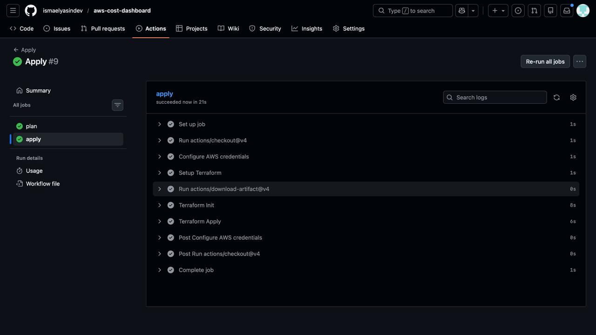

# AWS Cost Dashboard

A full stack web application for visualizing AWS cost and billing data across multiple accounts. This project demonstrates modern cloud infrastructure deployment using AWS services, containerization with Docker, and automated CI/CD pipelines with GitHub Actions.

## Live Application

The application is deployed and accessible at:

**https://dashboard.ismaelawsdashboard.site**

## Overview

This project showcases a production ready deployment of a React frontend and Node.js backend on AWS infrastructure. The application displays cost analytics, service breakdowns, regional distribution, and budget alerts for AWS accounts. The entire infrastructure is managed through Terraform, and deployments are automated through GitHub Actions workflows.

## Architecture

The system follows a microservices architecture pattern with clear separation between frontend and backend. The infrastructure spans multiple availability zones for high availability, uses private subnets for security, and implements automated scaling and monitoring.


## Demo

Watch the application running in production:


The deployment architecture includes:

**Developer Workflow**
Code changes pushed to GitHub trigger automated workflows that build Docker images, push them to ECR, and deploy infrastructure changes through Terraform.

**User Access Flow**
Users access the application through Route53 DNS resolution, which routes traffic through an Application Load Balancer with SSL termination. The ALB distributes requests to ECS tasks running in private subnets.

**Infrastructure Components**
The VPC spans two availability zones with public subnets hosting the load balancer and NAT gateway, while private subnets contain the application containers. This design ensures security through network isolation while maintaining internet connectivity for container image pulls and external API calls.

## Technology Stack

**Frontend**
React with TypeScript for type safety and component based architecture. Tailwind CSS for styling and Recharts for data visualization.

**Backend**
Node.js with Express.js serving RESTful APIs and static files. The backend provides endpoints for cost data, account information, and budget alerts.

**Infrastructure**
Terraform manages all AWS resources including VPC, ECS Fargate, Application Load Balancer, Route53, ACM certificates, and security configurations. The infrastructure is modularized for maintainability.

**Containerization**
Docker multi stage builds optimize image size and build time. Images are stored in ECR with immutable tags based on commit SHAs.

**CI/CD**
GitHub Actions workflows handle building, testing, and deployment. OIDC authentication provides secure AWS access without storing credentials.

**Monitoring**
CloudWatch collects logs and metrics. SNS sends email alerts for high CPU usage, memory issues, and application errors.

## Features

The dashboard provides several views into AWS cost data:

Cost Overview displays total spending across accounts with month over month comparisons and trend indicators.

Service Breakdown shows spending by AWS service with visual charts for easy identification of cost drivers.

Regional Distribution maps costs across AWS regions to identify geographic spending patterns.

Budget Alerts highlights accounts approaching or exceeding budget thresholds.

Cost Trends presents historical spending data over the last seven months with trend analysis.

Account Management lists all AWS accounts with individual cost summaries and status indicators.

## Project Structure

```
aws-cost-dashboard/
├── App/
│   ├── src/              # React frontend source code
│   ├── server/           # Node.js backend API
│   └── public/           # Static HTML files
├── docker/
│   └── Dockerfile        # Multi stage Docker build
├── infrastructure/        # Terraform infrastructure code
│   ├── modules/         # Reusable Terraform modules
│   └── *.tf             # Main configuration files
└── .github/
    └── workflows/       # GitHub Actions CI/CD pipelines
```

## Getting Started

**Prerequisites**

An AWS account with appropriate permissions, a domain name for Route53, Terraform installed locally, and a GitHub repository with Actions enabled.

**Initial Setup**

Clone the repository and navigate to the infrastructure directory. Copy the example variables file and configure it with your domain name, GitHub repository, and email address. Initialize Terraform and apply the configuration to create all AWS resources.

**Deployment**

After initial setup, deployments happen automatically. Push code to the main branch and GitHub Actions will build the Docker image, push it to ECR, run Terraform plan, wait for manual approval, and apply the changes. The health check workflow verifies the deployment succeeded.

## CI/CD Pipeline

The deployment pipeline consists of three workflows that run sequentially.

**Deploy Workflow**

Builds the Docker image using a multi stage build process. The frontend is compiled and optimized, then combined with the backend server code. The final image is tagged with the commit SHA and pushed to ECR.



**Apply Workflow**

Runs Terraform plan to preview infrastructure changes. The plan is saved as an artifact and uploaded. After manual approval through the production environment, Terraform apply executes the changes. This ensures infrastructure modifications are reviewed before implementation.


**Health Check Workflow**

Waits for the deployment to stabilize, then repeatedly checks the application health endpoint. The workflow retries up to ten times with thirty second intervals. If the health check passes, the deployment is considered successful.


## Learning Curve and Challenges

Building this project involved learning several new concepts and overcoming various challenges.

**Infrastructure as Code**

Terraform was new territory. Understanding how to structure modules, manage state, and handle dependencies between resources required significant research and experimentation. The transition from manual AWS console operations to declarative infrastructure code was a major shift in thinking.

**Container Orchestration**

ECS Fargate abstracts away server management but introduces concepts like task definitions, service configurations, and container networking. Getting the networking right with public and private subnets, security groups, and load balancer target groups took multiple iterations.

**CI/CD Automation**

Setting up GitHub Actions workflows that securely access AWS without storing credentials was challenging. OIDC authentication required understanding IAM roles, trust policies, and GitHub's token system. Debugging workflow failures required learning to read logs effectively.

**Docker Multi Stage Builds**

Optimizing Docker images while maintaining build speed required understanding multi stage builds. Getting the React build artifacts in the right location for the Express server to serve them correctly caused several deployment failures before resolution.

**Network Security**

Designing the VPC architecture with proper subnet isolation while maintaining necessary connectivity was complex. Understanding when to use NAT Gateway versus VPC Endpoints, and configuring security groups correctly, required deep diving into AWS networking documentation.

**State Management**

Managing Terraform state in S3 with DynamoDB locking required understanding remote backends and state locking mechanisms. Resolving state conflicts and understanding when to import existing resources versus creating new ones was a learning process.

## Future Improvements

Several enhancements could improve the project further.

**Database Integration**

Currently the application uses mock data. Integrating with AWS Cost Explorer API or storing historical data in DynamoDB would provide real cost insights. This would require implementing data collection jobs and building a proper data model.

**Authentication and Authorization**

Adding user authentication would allow multiple users to access the dashboard securely. AWS Cognito could handle user management, and IAM policies could control access to different accounts or features.

**Auto Scaling**

Implementing auto scaling based on CPU and memory metrics would handle traffic spikes automatically. This would require configuring ECS service auto scaling and setting appropriate scaling policies.

**Multi Environment Support**

Supporting development, staging, and production environments would improve the deployment workflow. This could involve environment specific Terraform workspaces and separate GitHub environments for each stage.

**Enhanced Monitoring**

Adding more detailed CloudWatch dashboards and custom metrics would provide better visibility into application performance. Implementing distributed tracing would help debug issues across services.

**Cost Optimization**

Implementing cost alerts and recommendations based on actual AWS spending patterns would make the dashboard more valuable. This could integrate with AWS Cost Anomaly Detection or build custom analysis.

**Testing**

Adding automated tests for both frontend and backend would improve code quality. Unit tests, integration tests, and end to end tests would catch issues before deployment.

**Documentation**

Expanding documentation with architecture decision records and operational runbooks would help with maintenance. API documentation and deployment guides would make the project more accessible.

## Infrastructure Details

The infrastructure is designed for production use with high availability and security in mind.

**Networking**

The VPC spans two availability zones for redundancy. Public subnets host the load balancer and NAT gateway, while private subnets contain application containers. This design isolates application code from direct internet access while maintaining necessary connectivity.

**Compute**

ECS Fargate runs containerized tasks without managing servers. The service automatically replaces unhealthy tasks and maintains the desired count. Resource limits prevent any single task from consuming excessive resources.

**Load Balancing**

The Application Load Balancer distributes traffic across tasks in both availability zones. Health checks ensure only healthy tasks receive traffic. HTTPS is enforced with automatic HTTP to HTTPS redirection.

**Security**

Security groups restrict network traffic to necessary ports only. WAF rules protect against common web attacks. IAM roles follow least privilege principles. Private subnet isolation prevents direct internet access to application containers.

**Monitoring**

CloudWatch collects application logs and system metrics. Alarms trigger email notifications via SNS when thresholds are exceeded. Container Insights provides detailed ECS metrics for troubleshooting.

## License

MIT
